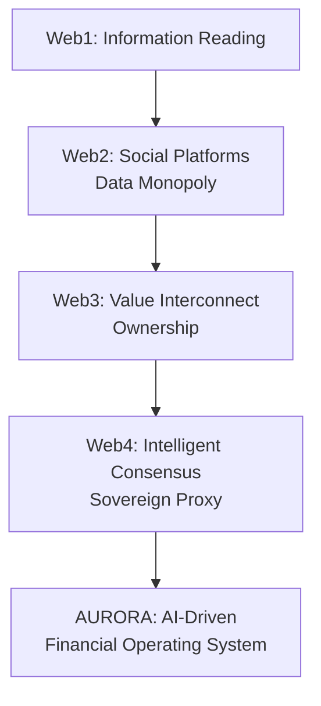

# Chapter 1: Foreword & Vision —— The Ultimate Evolution of Digital Existence

#### 1.1 The Non-linear Evolution of Human Monetary Civilization
From the shells of primitive society to the AURORA of 2026, humanity's pursuit of a "value carrier" has undergone a non-linear evolution spanning thousands of years. Every fundamental leap in technology is accompanied by a reshuffling of wealth distribution rights.

*   **Physical Consensus Phase**:
    Substances with physical scarcity like shells and gold became the consensus. Wealth during this period was highly dependent on physical mining and geographical monopoly, with extremely low liquidity but strong natural anti-inflationary properties.
*   **Institutional Consensus Phase**:
    Fiat currency improved circulation efficiency through the endorsement of sovereign state violence machines and credit systems. However, this centralized model brought inevitable "monetary hegemony" and "unlimited inflation." At the singularity of credit overdraft, the traditional paper currency system is facing an unprecedented collapse of trust.
*   **Mathematical Consensus Phase**:
    Web3 assets represented by Bitcoin utilized hash algorithms to establish asset ownership. This marked the first time humanity achieved the codification of "sacred and inviolable private property." But Web3 remains static; assets themselves lack the intelligence for self-appreciation and responding to complex market fluctuations.
*   **Intelligent Consensus Phase**:
    This is the **Web4 era** represented by AURORA. Here, assets are not just "owned" but "possess wisdom." Assets can perceive macro risks, autonomously execute optimal paths, and achieve cross-dimensional value reconstruction through the distributed computing power of AI.

#### 1.2 The "Dark Box Era" of Traditional Finance and Wall Street's Information Wall
In Traditional Finance (TradFi), Wall Street elites have built a thick information wall through the following means:
1.  **Millisecond Harvesting of High-Frequency Trading (HFT)**: Utilizing dedicated fiber optics and expensive hardware to complete arbitrage before ordinary investors can react.
2.  **"Black-Boxing" of Complex Derivatives**: Passing risks to retail investors lacking professional knowledge through layered packaging of tools like CDOs and CDSs.
3.  **Centralized Monopoly of Insider Information**: Top hedge funds obtain first-hand non-public information through expensive Expert Networks.

The birth of AURORA aims to utilize the unbiased predictive capabilities of the **AuraPredict AI Engine** to democratize financial decision-making power, which originally belonged only to the top of the pyramid (such as institutions like PanAgora managing tens of billions of dollars), to every AURORA holder through code and computing power equality.

#### 1.3 2026: The Credit Singularity and the Need for a Safe Haven
We are at a singularity of fiat credit overdraft. Global debt scales have reached unsustainable levels, and traditional safe-haven logic (such as holding US Treasuries) is failing.
*   **The Invisible Plunder of Inflation**: Global average inflation rates remain high, meaning holding fiat currency is a slow suicide for assets.
*   **DeFi's "Death Spiral" Pain Point**: Traditional DeFi protocols often fall into a vicious cycle of "liquidity mining -> token inflation -> price drop -> exit" due to a lack of real productivity support.

AURORA provides a smart safe haven with a fixed total supply, extreme deflation, and support from real productivity (AI arbitrage surplus + RWA physical asset interest rate spreads). This is not just a token; it is an intelligent financial lifeform capable of self-evolution and self-defense.

#### 1.4 Our Vision: From "Algorithmic Harvesting" to "Algorithmic Justice"
AURORA Labs firmly believes that AI should not become the "ultimate sickle" for large capital to harvest ordinary people, but rather the "digital shield" protecting individual sovereign assets.
Our mission is:
*   **Computing Power Equality**: Allowing retail investors to enjoy AI prediction services at the level of top hedge funds.
*   **Value Symbiosis**: Building a strong deflationary ecosystem where the interests of all participants are highly aligned.
*   **Perpetual Autonomy**: Ensuring the system is free from interference by any centralized institution or individual through decentralized governance, realizing the return of financial justice.

#### 1.5 Why Now?
2026 is the inaugural year of Web4. The maturity of Large Language Models (LLMs) and the perfect fit with blockchain scaling solutions (L2/L3) have turned "on-chain native AI" from a concept into reality. AURORA stands at the forefront of the era, ready to launch a magnificent financial revolution.

**Industry Evolution Logic Diagram:**

