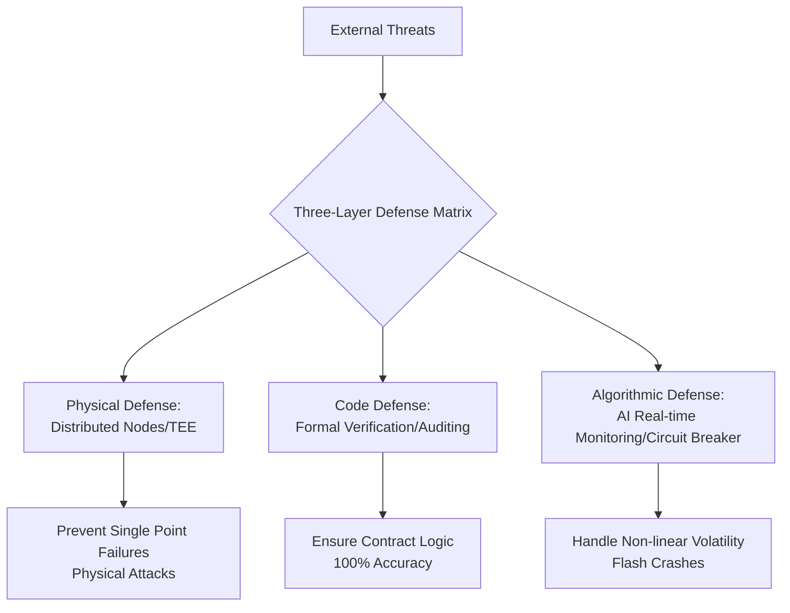

# Chapter 10: Security Defense Matrix: Three-Layer Defense and Formal Verification

In the era of Web4 intelligent finance, security is no longer an afterthought; it is a fundamental gene present since the protocol's inception. AURORA has built a **"Three-Layer Defense Matrix"** designed to counter threats ranging from smart contract vulnerabilities to AI model biases.

**Security Defense Architecture**:

#### 10.1 Core Code Defense: Formal Verification
Unlike traditional testing, formal verification uses mathematical proofs to ensure that the contract's behavior matches expectations under **all possible inputs**.
*   **Black Hole Logic Verification**: Proves that the correspondence between token burning and computing power generation is immutable under any numerical overflow conditions.
*   **Dividend Actuarial Verification**: Proves that the 1.2% dividend distribution logic cannot lead to treasury depletion through re-entrancy attacks.
*   **Cross-Auditing**: The protocol has undergone deep audits by three top global security firms (e.g., CertiK, OpenZeppelin, SlowMist), with the full audit reports published on-chain.

#### 10.2 Algorithmic Defense Layer: Aura-Monitor Real-time Alerts
AI is used not only for profit but also for defense.
*   **Anomaly Traffic Identification**: AI monitors all-chain transactions in real-time. Once it identifies "MEV attacks" or "large-scale wash trading" targeting the liquidity pools, the system automatically adjusts slippage protection or triggers a temporary cooling-off period.
*   **Risk Circuit Breaker**: Upon identifying non-linear collapse signs similar to LUNA/FTX, the AI engine automatically locks core treasury reserves and issues emergency hedge commands to all Genesis nodes.

#### 10.3 Physical Defense Layer: Distributed Nodes and TEE Secure Environments
*   **Distributed Governance**: 500 Genesis nodes are distributed across different global jurisdictions and cloud providers, eliminating risks of single-point physical failure or administrative blocking.
*   **Trusted Execution Environment (TEE)**: Key AI inference and multi-sig private key processing run in hardware-level isolated environments (such as Intel SGX), ensuring core keys remain secure even if the node's operating system is compromised.

#### 10.4 Emergency Response and Safety Fund
*   **Aurora Safety Fund**: The protocol automatically injects 5% of daily AI profits into an independent safety fund address.
*   **Risk Coverage**: This fund is specifically used to cover asset losses caused by unforeseen black swan events (such as underlying public chain collapses).
*   **White-Hat Bounty Program**: We maintain a perpetual $1,000,000 USDT white-hat bounty to encourage global developers to find and report potential vulnerabilities.

#### 10.5 Security Philosophy: Countering System Entropy
We believe that absolute security does not exist. AURORA's security philosophy is **"Dynamic Evolution"** —— through continuous AI self-learning and frequent rotation of the node matrix, the system remains in a highly ordered state, countering the inevitable entropy (chaos) in decentralized networks.