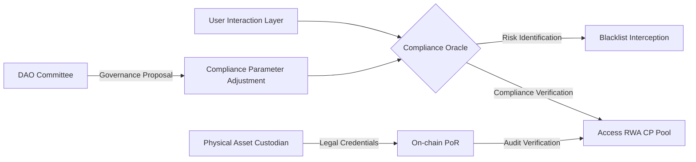

# Chapter 11: Global Compliance Framework: VASP, MiCA, and RWA Regulatory Adaptation

#### 11.1 Phased Compliance Roadmap
AURORA does not reject regulation; we pursue "compliant decentralization." To protect the asset security of participants worldwide and achieve the legalized circulation of RWA assets, we have formulated a strict compliance roadmap:

*   **Phase 1: Infrastructure Compliance (2026)**:
    *   **Offshore Architecture Establishment**: Establish a non-profit legal entity (Foundation) in tax havens and crypto-friendly jurisdictions (such as the Cayman Islands and Seychelles) responsible for early code guidance and open-source governance of the protocol.
    *   **Initial Compliance Review**: Hire top global law firms to conduct securities law property evaluations (deep Howey Test analysis) of the "Black Hole Protocol" and "Computing Power Sharing" logic.
*   **Phase 2: Access Compliance and License Application (2027)**:
    *   **VASP License Application**: Apply for Virtual Asset Service Provider permits in the European Union (under the MiCA framework), the UAE (VARA), and Hong Kong (VASP).
    *   **Geo-Fencing**: For users in specific regions (such as the United States, China, etc.), automatically trigger access restrictions or specific KYC/AML checks through integrated third-party service providers.
*   **Phase 3: Asset Compliance and Deep RWA Integration (2028)**:
    *   **RWA Asset Title Confirmation**: Collaborate deeply with compliant custodians (such as Ondis, Matrixdock) to ensure that underlying anchored US Treasuries and physical gold have a complete legal chain and real-time on-chain Proof of Reserves (PoR).
    *   **Regular Auditing**: Publish quarterly treasury asset audit reports issued by "Big Four" accounting firms.

#### 11.2 Compliance Oracle and Smart Contract Gateway
To cope with the complex global regulatory environment, AURORA innovatively introduces a **Compliance Oracle**:
*   **Real-time Blacklist Database**: Integrates data streams from Chainalysis and Elliptic to automatically identify and intercept capital injections from sanctioned regions or suspicious money-laundering addresses.
*   **Smart Contract Geo-Fencing**: Dynamically adjusts the computing power pools a user can participate in based on their IP and on-chain credentials (SBT) at the time of signing. For example, only qualified accredited investors can participate in specific real estate RWA pools.

#### 11.3 Legal Status of Aurora DAO: From Code to Entity
Aurora DAO is exploring registration as a **DAO Legal Entity** in Wyoming or the Marshall Islands.
*   **Legal Personality**: This means the DAO has the right to sign legal documents in the physical world, hold bank accounts, hire development teams, and initiate legal proceedings in extreme cases.
*   **Limited Liability**: Through a compliant legal architecture, it provides legal protection similar to a limited liability company for DAO participants, truly realizing the convergence of "Code is Law" and "Reality is Law."

#### 11.4 Transparency Reports and Comprehensive PoR (Proof of Reserves)
We firmly believe that transparency is the cornerstone of trust:
1.  **24/7 Real-time Dashboard**: Displays USDT reserves in the treasury, RWA asset anchoring status, and real-time burning data of black hole tokens.
2.  **Merkle Tree Proof**: Users can verify at any time via a Merkle tree whether their computing power assets are correctly counted in the system's total balance and whether treasury funds are sufficient.

**Global Compliance Governance Architecture**:

