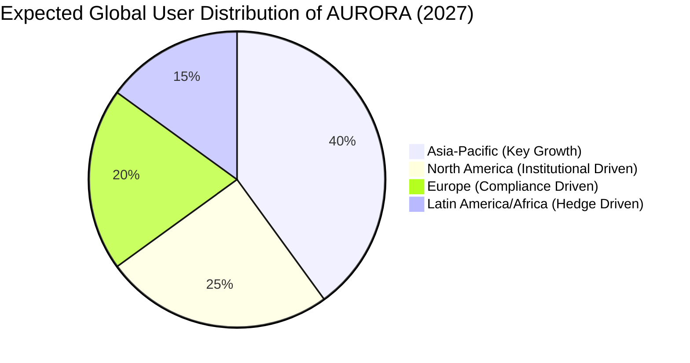

# Chapter 12: Regionalization Strategy: Localized Community Growth with a Global Vision

#### 12.1 Aurora Ambassadors: Global Value Communicators
AURORA's global expansion relies on highly localized, community-driven efforts. We are recruiting **1,000 Aurora Ambassadors** across four core global language regions to build a decentralized promotion matrix.

*   **Scope of Responsibilities**:
    *   **Localized Narrative**: Translating whitepapers and technical documents into native languages and adapting brand narratives to local cultural habits.
    *   **Offline Workshops (Aurora Meetups)**: Hosting "Web4 and AI Finance" themed salons in core cities to lower entry barriers for ordinary users.
    *   **Node Operation Support**: Assisting local node operators with hardware deployment and network optimization.
*   **Incentive Mechanism**:
    *   Ambassadors receive exclusive "Ambassador CP Bonuses." For every black hole burn contributed by their referred users, ambassadors receive an additional 0.5% USDT dividend.
    *   The right to participate in "Aurora Closed-Door Meetings" and communicate directly with the core team.

#### 12.2 Regionalized Compliance Pools and RWA Adaptation
Since definitions of RWA assets vary by country, AURORA adopts a "tailored" strategy:
*   **Asia-Pacific**: Focuses on high-liquidity stablecoin arbitrage and integration of tokenized commodities (such as Pax Gold).
*   **EMEA & North America**: Focuses on tokenized US Treasuries (Ondis) and compliant real estate trust assets.
*   **Emerging Markets (Latin America & Africa)**: Addressing the rigid demand for "strong deflationary assets" in high-inflation environments, focusing on promoting AURORA's black hole value reconstruction logic as a hedge against local fiat currencies.

#### 12.3 Sub-DAOs: Regionalized Governance
When the number of active nodes in a specific region exceeds 100, the system supports the establishment of a **Regional Sub-DAO**:
*   **Local Treasury**: Sub-DAOs have discretionary power over a certain percentage of regional transaction taxes for local community building and marketing activities.
*   **Specialized Proposals**: Sub-DAOs can initiate specialized incentive proposals for their region (e.g., hosting local developer hackathons).
*   **Cultural Customization**: Support for integrating local language multi-modal interaction interfaces in the Aurora Assistant.

#### 12.4 Global Liquidity Corridor
AURORA aims to build a borderless financial network.
*   **Cross-chain Dispatch**: Through the AI engine's cross-chain dispatch, users even in areas with underdeveloped financial infrastructure can enjoy top-tier global quantitative yields using just a smartphone and an Aurora OS assistant.
*   **Payment Integration**: Future plans involve collaborating with local crypto debit card providers to enable real-time offline spending of computing power output (USDT).

**Regional Growth Matrix Forecast (2027):**

#### 12.5 Aurora Academy
To improve the overall financial literacy of the community, we have established the Aurora Academy:
*   **Curriculum System**: Covers AI quantitative basics, blockchain security, Web4 philosophy, etc.
*   **Completion Rewards**: Users who complete courses and pass assessments will receive a "Knowledge CP Badge," permanently increasing their dividend weight by 0.1%.