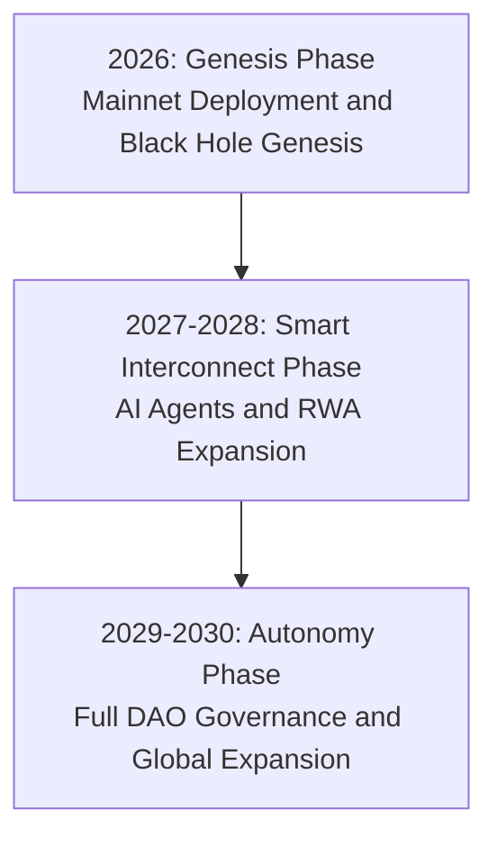

# Chapter 13: Five-Year Strategic Roadmap: The Aurora Trilogy (2026-2030)

AURORA's development is not just an iteration of technology, but a migration process of global wealth consensus. We have divided it into three core phases.

**Strategic Planning Timeline**:

#### 13.1 Phase 1: Aurora First Light (2026) —— Building the Foundation of Trust

> **Core Goal**: Complete mainnet deployment, establish the first 500 physical nodes worldwide, and achieve initial deflation of the AURORA token.

*   **2026 Q1: Genesis Big Bang**
    *   Official deployment of AURORA mainnet contracts, launching the Black Hole Genesis competition.
    *   Release of AuraPredict 1.0 Beta, supporting volatility prediction for major assets (BTC/ETH).
*   **2026 Q2: Node Matrix Construction**
    *   Completion of multi-sig initialization and hardware deployment for 500 Genesis nodes worldwide.
    *   Launch of the "Aurora Ambassador" global recruitment program.
*   **2026 Q3: AI Strategy Implementation**
    *   Launch of the Aura-Executor automated execution module, initiating the first treasury buyback and burn.
    *   Integration of the first batch of tokenized US Treasuries (RWA) yield base.
*   **2026 Q4: Deflation Milestone**
    *   Total supply expected to deflate to 75,000,000 tokens.
    *   Publication of the "AURORA Annual Security and Actuarial Transparency Report."

#### 13.2 Phase 2: Smart Interconnection (2027-2028) —— Inclusive Financial Expansion

> **Core Goal**: Launch mobile OS, achieve large-scale RWA management, and complete the 90% deflation target for tokens.

*   **2027 Q2: Aurora OS Goes Mobile**
    *   Official release of **Aurora OS Mobile** (Android/iOS), integrating an AI voice trading assistant.
    *   Launch of the "Copy Trading" feature, allowing novice users to synchronize expert node strategies with one click.
*   **2027 Q4: RWA Scaling**
    *   RWA computing power pool target size exceeds 10 billion USDT, covering real estate, treasuries, and commodities.
    *   Deep protocol integration with major global compliant oracles.
*   **2028 Q3: Deflation Critical Point**
    *   Tokens complete 90% deflation (10,000,000 remaining), **officially opening two-way secondary market trading**.
    *   Launch of AuraPredict v2.5, supporting multi-modal social sentiment analysis.

#### 13.3 Phase 3: Eternal Sparks (2029-2030) —— Global Financial Operating System

> **Core Goal**: Achieve full decentralized autonomy, with AURORA becoming the global standard for intelligent digital gold.
*   **2029: API-Driven Ecosystem Explosion**
    *   AURORA API becomes the standard prediction interface for global Web4 financial applications, with thousands of DApps running on the Aurora network.
    *   Realization of full decentralized storage and computing power scheduling, with no single point of failure risk.
*   **2030: Sovereign Autonomy and Permission Burning**
    *   Achievement of full "autonomous operation," with all core development permissions permanently destroyed via multi-sig.
    *   AURORA becomes the global standard for anti-inflation, high-yield "intelligent digital gold," and the system enters perpetual mode.

#### 13.4 Long-term Vision: Interstellar Financial Consensus
Beyond 2030, Aurora Labs aims to explore AI prediction models based on quantum computing and is committed to extending this intelligent financial consensus to a broader space of digital existence, achieving the perpetual appreciation of human civilization's wealth.