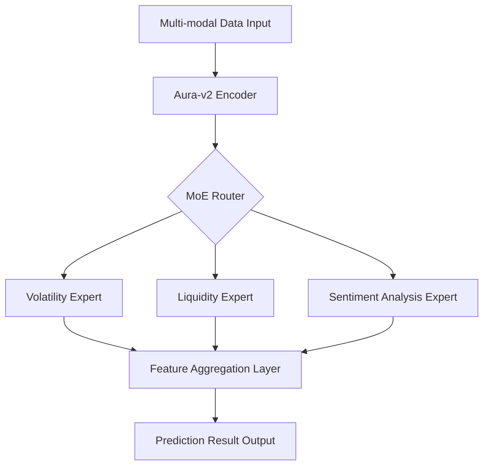

# Chapter 4 (Part 1): AuraPredict AI Model and Architecture

#### 4.1 Aura-Transformer-v2: Ultra-Large Scale Time Series Prediction Model
The core of AuraPredict is the **Aura-v2 Neural Network**, deeply optimized based on the Transformer architecture. Unlike GPT models that process text, Aura-v2 is specifically tailored for non-stationary, high-noise crypto-financial data.

**Core Technical Features:**
*   **Causal Multi-Head Attention**:
    $$ \text{Attention}(Q, K, V) = \text{softmax}\left(\frac{QK^T + M}{\sqrt{d_k}}\right)V $$
    By introducing a mask matrix $M$, it ensures that when predicting for time $t+1$, the model strictly cannot access data after $t+1$, completely eliminating data leakage.
*   **Multi-Scale Temporal Chunking**:
    The model convolves in parallel across four scales: 1min, 15min, 1h, and 1d. It captures instantaneous "wick" price movements (second-level) and macro-cycle trends (month-level).
*   **Sparse Mixture of Experts (MoE) Architecture**:
    Integrates 128 professional sub-networks (Experts), including:
    *   **Volatility Expert**: Analyzes the evolution of standard deviation in asset prices.
    *   **Whale Detector**: Identifies abnormal capital flows from the top 0.1% core wallets.
    *   **RWA Actuary**: Calculates the interest rate spread between physical assets and on-chain mapped assets.
    The routing network automatically activates the most relevant experts based on the input signal, maintaining a parameter count of 100B while keeping single-inference latency below 50ms.

#### 4.2 Federated Learning and Distributed Training
To prevent centralized monopoly of AI models, AURORA adopts a distributed Federated Learning framework:
1.  **Local Model Updates**: 500 Genesis nodes worldwide utilize locally collected market data to train miniature models.
2.  **Gradient Aggregation**: Only model weights (rather than raw data) are submitted to the mainnet for secure aggregation.
3.  **Protection Against Poisoning Attacks**: Utilizes the **Median Aggregation** algorithm, ensuring overall prediction accuracy remains stable even if 30% of nodes submit malicious data.

**Technical Architecture Panorama:**

