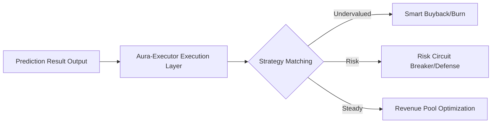

# Chapter 4 (Part 2): Multi-modal Perception and Automated Execution

#### 4.3 Multi-modal Data Perception Matrix (Data Sensor Matrix)
To achieve "foreseeing the future," the AI requires an all-encompassing sensory system:

1.  **Micro-On-chain Layer**:
    *   Real-time parsing of UTXO and balance changes for 2,000,000+ core addresses across the full chain.
    *   **Liquidity Depth Analysis**: Real-time calculation of slippage and attack risk coefficients for various pools in DEXs.
2.  **Psychological Sentiment Layer**:
    *   Utilizes deep NLP models to crawl 1,000,000+ daily comments from Twitter, Discord, and Telegram in real-time.
    *   **Sentiment Polarization Analysis**: Quantifies market fear and greed indices, identifying "emotional pivot points."
3.  **Macro-Global Layer**:
    *   Connects to macro data such as Fed overnight rates, CPI, and non-farm payrolls.
    *   **RWA Peg Monitoring**: Monitors on-chain valuation anomalies for underlying physical assets like gold and treasuries.

#### 4.4 Automated Execution: Aura-Executor and Risk Circuit Breakers
Prediction is just the starting point; execution is the value. **Aura-Executor** is the "Sword Bearer" of the protocol.

*   **AI-Buyback**:
    When the AI predicts that the price is in a severely undervalued range and the probability of an increase in the next 48 hours is > 85%, the Executor automatically calls treasury funds to execute tiered buybacks and burns.
*   **Risk Circuit Breaker**:
    Once non-linear anomaly patterns similar to "Luna-style collapse" or "FTX-style run" are identified, the system automatically increases liquidity pool dividend reserves within milliseconds and issues emergency hedge signals to nodes.

#### 4.5 Dimensional Comparison between AuraPredict and Traditional Quantitative Models (PanAgora)
AuraPredict inherits and surpasses PanAgora's "Contextual Alpha Modeling":
*   **Dynamic Factor Evolution**: Traditional quant uses fixed factors, while AuraPredict factors evolve every second with AI learning.
*   **Computing Power Equality**: Through distributed computing nodes, the predictive power originally exclusive to institutions is pushed down to every ordinary token holder.

**Execution Flow Logic Diagram:**

