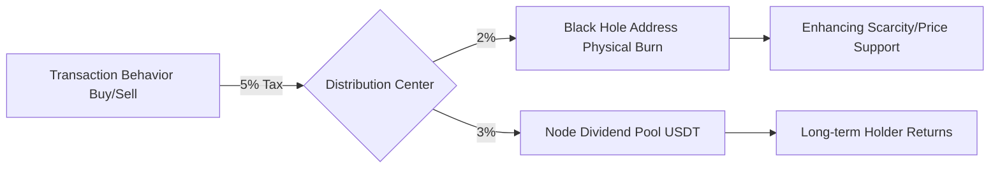

# Chapter 5 (Part 1): Strong Deflationary Monetary Model and Tax System

The AURORA token (Symbol: AURORA) is the lifeblood of the Web4 ecosystem. Its design is centered on **"extreme scarcity,"** **"strong deflation,"** and **"game-theoretic equilibrium."** We have completely abandoned the high emission models of traditional DeFi in favor of a negative growth logic similar to a "physical black hole."

#### 5.1 Supply Function and Negative Exponential Deflation Model
Unlike the inflationary logic of traditional tokens, the supply of AURORA follows a negative exponential decay rule.

**Supply Evolution Formula**:
$$ S(t) = S_{initial} \cdot e^{-\lambda t} $$
where the decay coefficient $\lambda$ is a dynamic function of trading activity ($V$), black hole conversion rate ($\alpha$), and the AI adjustment factor ($\gamma$):
$$ \lambda = k_1 \cdot V_{volume} + k_2 \cdot \alpha_{blackhole} + k_3 \cdot \gamma_{AI} $$

**Supply Distribution Panorama**:
*   **Initial Total Supply**: 100,000,000 AURORA
*   **Ultimate Circulation Target**: 10,000,000 AURORA (90% deflation)
*   **Zero Private Sale, Zero Reserve, Zero Team Share**: 100% generated by open market liquidity, ensuring absolute fairness in the ecosystem. This "Fair Launch" model eliminates the risk of institutional dumping.

#### 5.2 Transaction Tax Game Model: The Nash Equilibrium of 3% and 2%
AURORA sets a 5% transaction tax on both buys and sells. This is not just protocol revenue but a gravitational field maintaining the ecosystem's game-theoretic balance.

**Tax Flow Diagram**:

1.  **Physical Burn Pool (2%)**: 2% of every transaction is sent directly to the black hole address. These tokens mathematically disappear forever, directly reducing the total denominator and increasing the value of each single token.
2.  **Node Dividend Pool (3%)**: Distributed in USDT to global nodes. This ensures that holders' returns are "fiat-based" real money rather than more depreciating tokens.