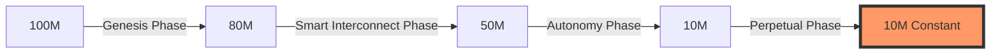

# Chapter 5 (Part 2): Game Scenario Simulation and Liquidity Gravity

#### 5.3 Three-Way Game Equilibrium: [A] Speculation, [B] Holding, [C] Conversion
In the AURORA ecosystem, participants face three core game paths:

*   **Path [A]: Short-term Speculation**
    Facing a rigid 10% round-trip tax loss, the mathematical expected return for short-term speculators is negative in most sideways markets. This effectively filters out market noise.
*   **Path [B]: Long-term Holding (HODL)**
    Holders enjoy the "deflationary premium" brought by the 2% burn. As the supply decreases from 100 million to 10 million, the ecosystem ownership represented by a single token increases tenfold.
*   **Path [C]: Black Hole Conversion (The Optimal Strategy)**
    Burning tokens to exchange for USDT computing power worth 2x the value, and enjoying a daily output of 1.2%.
    **Nash Equilibrium Point**: Actuarial analysis shows that when the price is steady, the Internal Rate of Return (IRR) of path [C] is significantly higher than [A] and [B]. This attracts the majority of smart capital to actively enter the black hole, thereby locking in early liquidity and eliminating dumping pressure.

#### 5.4 Liquidity Gravity Trap
Until the supply has deflated to 10,000,000 tokens, the platform executes a rigid **"buy-only, no-sell"** strategy.

**Why do this?**
1.  **Building a Solid Value Foundation**: Forcing early speculative capital to convert into long-term "black hole computing power." This is equivalent to transforming scattered liquidity into stable, productive protocol assets.
2.  **Creating Extreme Token Scarcity**: When 90% of tokens are burned or locked, and market demand increases with the improvement of AI prediction accuracy, a massive "price pulse effect" will be generated when two-way trading is officially enabled.

#### 5.5 Price Elasticity and Deflation Rate Simulation
Through 100,000 Monte Carlo simulations, it shows:
*   **Base Case**: With a daily trading volume of 5 million USDT, reaching the deflation target takes approximately 18 months.
*   **Bull Case**: With a daily trading volume of 20 million USDT, the deflation process will shorten to 4 months.

**Token Supply Decay Simulation Diagram**:

