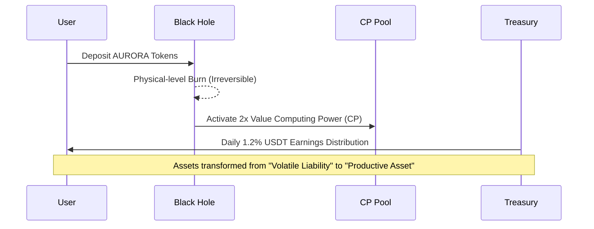

# Chapter 6 (Part 1): Black Hole Protocol and Value Reconstruction Logic

AURORA introduces a revolutionary **"Black Hole Value Reconstruction"** mechanism. This is not just a burning method, but an energy field that cross-dimensionally transforms volatile token assets into deterministic productive power.

#### 6.1 Black Hole Physical Logic: The Leap from "Circulating Supply" to "Productivity"
In the AURORA system, the black hole address `0x000...dead` serves as the core role of the energy transformation field.

**Value Reconstruction Flowchart**:

*   **Physical-level Burn**: Once tokens are sent to the black hole, the mathematical impossibility of constructing its private key means those tokens permanently exit circulation. This guarantees the "absolute deflation" of AURORA from a physical level.
*   **Computing Power Minting Formula**:
    $$ CP_{new} = \text{Amount}_{burn} \cdot Price_{AURORA/USDT} \cdot \Gamma $$
    where the incentive coefficient $\Gamma$ is currently fixed at **2.0**.
    **This means**: If you burn AURORA tokens worth 1000 USDT, the system will generate 2000 **USDT Computing Power (CP)** for you. This is equivalent to sacrificing short-term liquidity in exchange for a double-valued fiat-based earnings certificate.