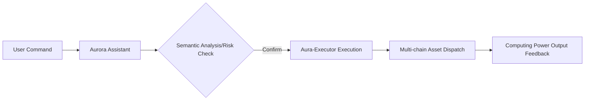

# Chapter 7: User Experience: AI Agent Assistant and Aurora Operating System (Aurora OS)

#### 7.1 Redefining Human-Machine Interaction: Aurora Assistant
In the Web4 era, users should not be overwhelmed by complex K-line charts and technical indicators. AURORA introduces the **Aurora Assistant**, an AI agent with natural language processing capabilities.

*   **Natural Language Trading**:
    Users do not need to learn complex smart contract interactions; they simply enter natural language commands.
    *   *Example*: "Help me allocate 1000 USDT to the high-yield computing power pool and automatically buy more when the AURORA price drops by 10%."
    *   *Logic*: The assistant automatically completes the purchase, black hole conversion, staking, and limit order settings through the backend Intent-Centric engine.
*   **Personalized Risk Profiling**:
    The assistant builds a dynamic risk model using Aura-LLM by analyzing the user's on-chain historical behavior.
    *   For conservative users: Prioritizes allocation to the RWA stable yield base.
    *   For aggressive users: Prioritizes allocation to high-volatility AI arbitrage premiums.
*   **24/7 Decision Support**:
    When the AI engine predicts market volatility exceeding a preset threshold (such as identifying potential flash crash risks), the assistant sends decision suggestions to the user through encrypted Telegram/Discord channels, providing one-click execution buttons.

#### 7.2 Core Components of the Aurora Operating System (Aurora OS)
Aurora OS is not a traditional underlying kernel but a highly integrated intelligent financial UI framework designed to bridge the gap between Web2 and Web3:

1.  **Yield Dashboard**:
    Utilizes multi-dimensional visualization technology to display "computing power health," "black hole deflation contribution," and a "global node distribution map" in real-time. Users can intuitively see how their assets are converted through the black hole and circulated among global nodes.
2.  **Strategy Canvas**:
    Allows advanced users to customize their own AI trading logic through simple drag-and-drop modules. For example: "If $AURORA deflation rate > 5%$ and $BTC$ volatility < 2%, automatically execute re-investment."
3.  **Privacy Vault**:
    Utilizes Zero-Knowledge Proofs (ZKP) and homomorphic encryption technology to ensure that users' personal identities, asset scales, and trading preferences remain completely confidential while enjoying AI prediction services. Even AURORA nodes cannot obtain a user's full privacy data.

#### 7.3 Chain-Agnostic Experience
AURORA is not limited to a single blockchain. Through integrated cross-chain liquidity protocols, users can seamlessly manage their computing power assets on Ethereum, Solana, Base, or the AURORA native chain.

**User Interaction Flowchart**:

#### 7.4 SocialFi Integration
*   **Copy Trading**: Ordinary users can subscribe to the AI strategies of Genesis nodes with one click, sharing a portion of the earnings as a service fee with the node.
*   **Community Incentives**: Within Aurora OS, active governance participants and high-quality strategy contributors receive additional "Activity Coefficient" rewards, directly improving their computing power output efficiency.