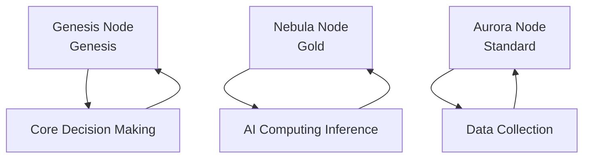
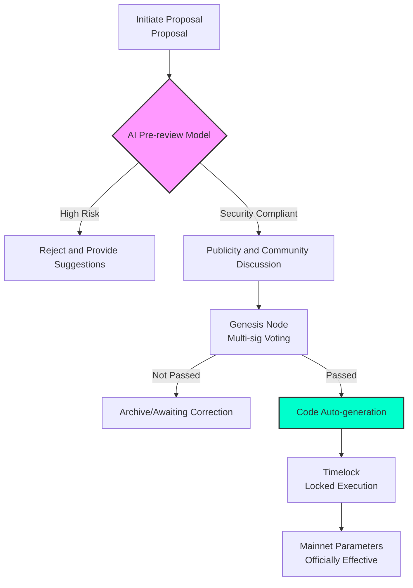

# Chapter 8: Global Node Matrix: Distributed Governance and Contribution Model

#### 8.1 Node Hierarchy and Responsibilities: A Three-Dimensional Productivity Matrix
AURORA nodes are the backbone of the ecosystem, responsible not only for maintaining network consensus but also for distributed AI inference and data collection. Nodes are divided into three levels, each with its unique production tasks and revenue weights:

**Node Matrix Architecture**:

1.  **Aurora Node (Standard)**:
    *   **Responsibilities**: Responsible for real-time collection of basic market data, social media sentiment crawling (NLP pre-processing), and localized community promotion.
    *   **Threshold**: Hold 10,000 AURORA or equivalent computing power and keep the node software online 7x24 hours.
    *   **Earnings**: Enjoys the base weight of the 3% tax dividend pool.
2.  **Nebula Node (Gold)**:
    *   **Responsibilities**: Responsible for local computation of distributed AI inference, cross-chain liquidity monitoring, and sensitive data processing within TEE secure environments.
    *   **Threshold**: Hold 50,000 AURORA and be equipped with high-performance computing hardware (recommended GPU VRAM > 12GB).
    *   **Earnings**: Dividend weight increased by 50%, and priority access to advanced AI analysis features (Alpha-Signal).
3.  **Genesis Node (Genesis)**:
    *   **Quantity**: Limited to 500 worldwide, aimed at establishing a highly resilient global governance network.
    *   **Responsibilities**: Responsible for voting on key protocol parameters (such as the $\Gamma$ coefficient and tax ratios), multi-sig management of major security matters, and final review of RWA asset integration.
    *   **Threshold**: Requires comprehensive evaluation by the DAO committee (holding amount, community influence, technical contribution) and staking 200,000 AURORA.
    *   **Earnings**: Enjoys 3x dividend weight and early airdrops from ecosystem incubation projects.

#### 8.2 Reputation Score and Dynamic Dividends
Governance rights should not be linked solely to token holdings. We introduce the **Reputation Score**, which acts as a multiplier for a node's final earnings:
*   **Burn Contribution ($R_b$)**: The more tokens contributed to the black hole, the higher the score.
*   **Stability Contribution ($R_s$)**: Node uptime, response speed, and inference accuracy.
*   **Governance Contribution ($R_g$)**: Participating in DAO proposal voting, submitting code patches, or writing in-depth research reports.
$$ \text{Total Score} = w_1 R_b + w_2 R_s + w_3 R_g $$

#### 8.3 DAO Governance Proposal Process: From Intent to Automated Execution
AURORA introduces an **"Intent-driven"** governance process, ensuring every technical iteration or parameter adjustment undergoes rigorous AI stress testing and democratic voting by the community.

#### 8.4 Slashing Mechanism
To prevent malicious node behavior or prolonged silence, the system has automatic slashing logic:
*   **Minor Violation**: Node offline for more than 24 hours results in a deduction of that day's earnings and a 1% reduction in Reputation Score.
*   **Major Violation**: Attempting to submit forged AI prediction data or maliciously colluding to attack the network.
    *   *Consequence*: 100% of staked AURORA tokens will be forfeited to the black hole address, and node eligibility will be permanently revoked.

#### 8.5 The Aurora Constitution
All ecosystem participants are bound by the "Aurora Constitution," a set of hard-coded rules of conduct in smart contracts:
1.  **Algorithmic Neutrality**: AI prediction results must be based on real mathematical models, and no individual or organization may artificially interfere with the prediction logic.
2.  **Interest Alignment**: The interests of the core team (developers) are strictly tied to the deflation rate of the total supply.
3.  **Permissionless Entry**: Anyone can freely join or exit the node matrix as long as they meet the technical and economic thresholds, achieving true decentralization.

#### 8.6 Hardware Specifications and Deployment Recommendations
To support high-concurrency inference for AuraPredict, Nebula-level and above nodes are recommended to use the following configuration:
*   **CPU**: 16 cores or more (e.g., AMD EPYC or Intel Xeon)
*   **RAM**: 128GB DDR5
*   **GPU**: NVIDIA RTX 4090 or A100 (supports compute acceleration)
*   **Bandwidth**: 1Gbps dedicated symmetric fiber
*   **System**: Aurora-OS (deeply customized based on Linux)