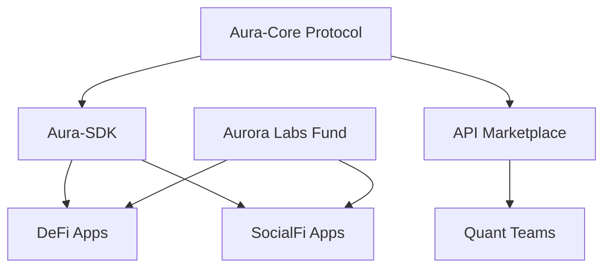

# Chapter 9: Developer Ecosystem: Aura-SDK, API, and Aurora Labs

#### 9.1 Aura-SDK: Empowering Third-Party Applications
AURORA's vision is to become the infrastructure for Web4 finance. We provide the **Aura-SDK** to global developers, supporting mainstream programming languages such as JavaScript, Python, Go, and Rust.

**Core SDK Modules**:
*   **Aura-Oracle Stream**: Allows third-party DApps to call AuraPredict's high-precision financial prediction results in real-time for building advanced financial functions like automated liquidation and dynamic margins.
*   **CP Asset Integration**: Developers can integrate AURORA computing power into their own applications (such as GameFi or SocialFi) as underlying collateral or yield enhancement plugins.
*   **ZKP Toolkit**: A built-in Zero-Knowledge Proof toolkit that supports developers in completing complex strategy authorizations without touching user private keys.

#### 9.2 Aurora API Marketplace
This is a decentralized data and algorithm trading platform designed to break down "data silos."

1.  **Data Providers**: Nodes or professional data companies can list their collected deep on-chain/off-chain raw data for sale via APIs.
2.  **Algorithm Providers**: Quantitative teams can upload their professional MoE expert sub-networks to the marketplace for other users to subscribe to.
3.  **Settlement Mechanism**: All API calls are settled in real-time using AURORA tokens via micropayments. 100% of the revenue goes to the providers, with the protocol taking zero commission.

#### 9.3 Aurora Labs Incubation Program
We will allocate 1% of the total output to the "Aurora Labs Fund" to incubate and support startup projects based on Web4 principles.

**Key Incubation Areas**:
*   **AI Algorithmic Stablecoins**: Next-generation stablecoins that automatically adjust supply based on AuraPredict results.
*   **Decentralized Insurance Protocols**: Utilizing AI to evaluate risk probabilities and achieve millisecond-level automated payout logic.
*   **RWA Asset Tokenization Platforms**: Efficiently connecting physical world assets to the AURORA computing power base.

#### 9.4 Developer Governance and Contribution
In the AURORA DAO, code contribution (Proof of Code) is considered a value output as important as token holdings.
*   **Code Audit Rewards**: Developers who find and fix core protocol vulnerabilities will receive substantial AURORA token rewards.
*   **AIP (Aurora Improvement Proposals)**: Any developer can submit protocol upgrade suggestions, which are executed via multi-sig by Genesis nodes after community approval.

**Developer Ecosystem Architecture**:
