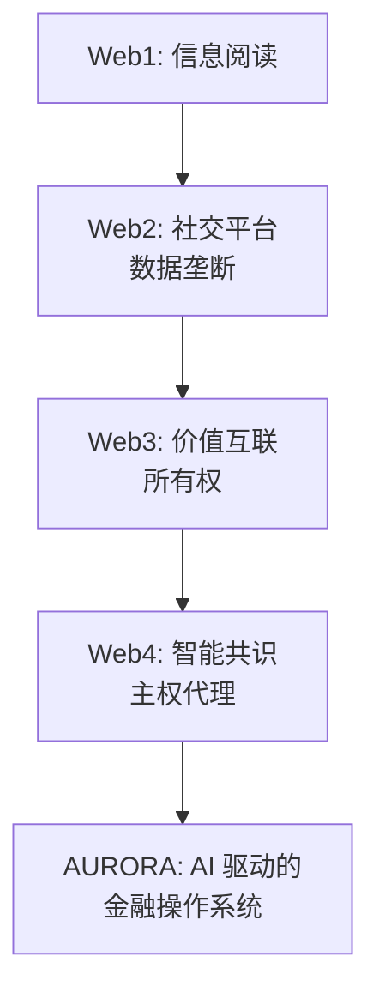

# 第一章：前言与愿景 —— 数字化生存的终极进化

#### 1.1 人类货币文明史的非线性演进
从原始社会的贝壳到 2026 年的 AURORA，人类对“价值载体”的追求经历了一场跨越数千年的非线性演进。每一次技术的底层飞跃，都伴随着财富分配权的重新洗牌。

*   **物理共识阶段 (Physical Consensus)**：
    贝壳、黄金等具备物理稀缺性的物质成为共识。这一时期的财富高度依赖于物理开采和地理垄断，其流动性极低，但具备极强的抗通胀天然属性。
*   **组织共识阶段 (Institutional Consensus)**：
    法币通过主权国家的暴力机器和信用体系背书，提升了流转效率。然而，这种中心化模型带来了不可避免的“货币霸权”与“无限通胀”。在信用透支的奇点，传统的纸币体系正面临前所未有的信任崩溃。
*   **数学共识阶段 (Mathematical Consensus)**：
    以比特币为代表时 Web3 资产利用哈希算法确立了资产的所有权。这标志着人类首次实现了“私有财产神圣不可侵犯”的代码化。但 Web3 仍然是静态的，资产本身不具备自我增值和应对复杂市场波动的智能。
*   **智能共识阶段 (Intelligent Consensus)**：
    这就是 AURORA 所代表的 **Web4 时代**。在这里，资产不仅是“被拥有”的，更是“具备智慧”的。资产能够感知宏观风险，能够自主执行最优路径，能够通过 AI 的分布式算力实现跨维度的价值重构。

#### 1.2 传统金融的“暗盒时代”与华尔街的信息围墙
在传统金融（TradFi）中，华尔街的精英们通过以下手段建立起了一道厚重的信息围墙：
1.  **高频交易 (HFT) 的毫秒级收割**：利用专用光纤和昂贵的硬件，在普通投资者反应过来之前完成套利。
2.  **复杂衍生品的“黑盒化”**：通过层层包装的 CDO、CDS 等工具，将风险转嫁给缺乏专业知识的散户。
3.  **内幕信息的中心化垄断**：顶级对冲基金通过昂贵的专家网络（Expert Networks）获取第一手非公开信息。

AURORA 的诞生，旨在利用 **AuraPredict AI 引擎** 的无偏见预测能力，将原本只属于金字塔顶端（如管理着数百亿美金的 PanAgora 等机构）的金融决策权，通过代码和算力平权，普惠给每一位持有 AURORA 的用户。

#### 1.3 2026：信用奇点与避风港需求
我们正处于一个法币信用透支的奇点。全球债务规模已达到不可持续的水平，传统的避险逻辑（如持有美债）正在失效。
*   **通胀的隐形掠夺**：全球平均通胀率持续高位，持有法币意味着资产的慢性自杀。
*   **DeFi 的“死亡螺旋”痛点**：传统的 DeFi 协议由于缺乏真实的生产力支撑，往往陷入“流动性挖矿 -> 代币通胀 -> 价格下跌 -> 退出”的恶性循环。

AURORA 提供了一个总量恒定、极致通缩且由真实生产力（AI 套利盈余 + RWA 物理资产利差）支撑的智能避风港。这不仅仅是一个代币，这是一个能够自我进化、自我防御的智能金融生命体。

#### 1.4 我们的愿景：从“算法收割”到“算法正义”
AURORA 实验室坚信，AI 不应成为大型资本收割普通人的“终极镰刀”，而应成为保护个人主权资产的“数字护盾”。
我们的使命是：
*   **算力平权**：让散户也能享受到顶级对冲基金级别的 AI 预测服务。
*   **价值共生**：建立一个所有参与者利益高度一致的强通缩生态。
*   **永续自治**：通过去中心化治理，确保系统不受任何中心化机构或个人干预，实现金融正义的回归。

#### 1.5 为什么是现在？(Why Now?)
2026 年是 Web4 的元年。大模型技术的成熟（LLMs）与区块链扩容方案（L2/L3）的完美契合，使得“链上原生 AI”从构想变为现实。AURORA 站在了时代的风口浪尖，准备开启一场波澜壮阔的金融革命。

**行业演进逻辑图：**

