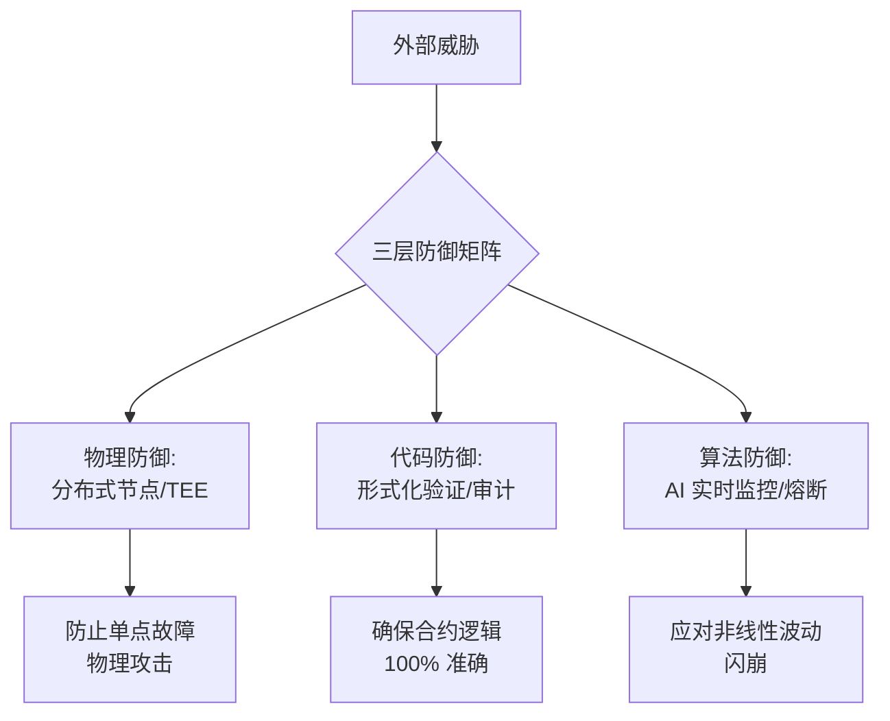

# 第十章：安全防御矩阵：三层防御与形式化验证

在 Web4 智能金融时代，安全不再是事后打补丁，而是协议创世之初的底层基因。AURORA 构建了一套**“三层防御矩阵”**，旨在应对从智能合约漏洞到 AI 模型偏差的全方位威胁。

**安全防御架构图：**

#### 10.1 核心代码防御：形式化验证 (Formal Verification)
不同于传统的测试（Testing），形式化验证通过数学证明的方式，确保合约在 **所有可能输入** 下的行为都符合预期。
*   **黑洞逻辑验证**：证明代币销毁与算力生成的对应关系在任何数值溢出（Overflow）情况下均不可篡改。
*   **分红精算验证**：证明 1.2% 的分红发放逻辑不会因合约重入（Re-entrancy）攻击而导致财库被掏空。
*   **交叉审计**：协议已通过全球三家顶级安全机构（如 CertiK, OpenZeppelin, SlowMist）的深度审计，审计报告全文在链上公示。

#### 10.2 算法防御层：Aura-Monitor 实时预警
AI 不仅用于获利，更用于防御。
*   **异常流量识别**：AI 实时监控全链交易，一旦识别到针对底池的“夹子攻击”或“大额洗盘”行为，系统将自动调整滑点保护或触发临时冷静期。
*   **风险熔断机制 (Circuit Breaker)**：在识别到类似 LUNA/FTX 式的非线性崩盘征兆时，AI 引擎会自动锁定财库的核心准备金，并向所有创世节点发布紧急避险指令。

#### 10.3 物理防御层：分布式节点与 TEE 安全环境
*   **分布式治理**：500 个创世节点分布在全球不同的司法管辖区和云服务商，杜绝了单点物理失效或行政封锁的风险。
*   **可信执行环境 (TEE)**：关键的 AI 推理和多签私钥处理在硬件级的隔离环境（如 Intel SGX）中运行，即使节点操作系统被黑客攻破，核心密钥依然安全。

#### 10.4 应急响应与保险基金 (Safety Fund)
*   **极光保险金**：协议将每日 AI 获利的 5% 自动注入一个独立的保险基金地址。
*   **风险覆盖**：该基金专门用于覆盖不可预见的黑天鹅事件（如底层公链崩溃）导致的资产损失。
*   **白帽奖励计划**：我们常年设立价值 1,000,000 USDT 的白帽黑客奖励，鼓励全球开发者发现并报告潜在漏洞。

#### 10.5 安全哲学：对抗系统熵增
我们认为，绝对的安全是不存在的。AURORA 的安全哲学是 **“动态演化”** —— 通过 AI 的不断自我学习和节点矩阵的频繁更替，使系统始终保持在高度有序的状态，对抗去中心化网络中不可避免的熵增（混乱）。
