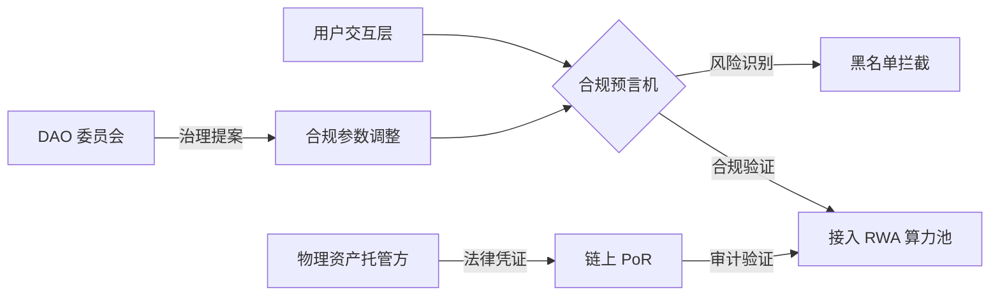

# 第十一章：全球合规性框架：VASP、MiCA 与 RWA 监管适配

#### 11.1 分阶段合规策略 (Phased Compliance Roadmap)
AURORA 并不排斥监管，我们追求的是“合规的去中心化”。为了在全球范围内保护参与者的资产安全并实现 RWA 资产的合法化流转，我们制定了严密的合规路线图：

*   **Phase 1：基础设施合规 (2026)**：
    *   **离岸架构建立**：在避税天堂及加密友好管辖区（如开曼群岛、塞舌尔）设立非营利性法律实体（Foundation），负责协议的早期代码引导与开源治理。
    *   **合规性初审**：聘请全球顶级律师事务所对“黑洞协议”与“算力分担”逻辑进行证券法属性评估（Howey Test 深度分析）。
*   **Phase 2：准入合规与牌照申请 (2027)**：
    *   **VASP 牌照申请**：在欧盟（MiCA 框架下）、阿联酋（VARA）及香港（VASP）申请虚拟资产服务商许可。
    *   **地理围栏 (Geo-Fencing)**：针对特定地区（如美国、中国等）的用户，通过集成的第三方服务商自动触发访问限制或特定的 KYC/AML 检查。
*   **Phase 3：资产合规与 RWA 深度融合 (2028)**：
    *   **RWA 资产确权**：与合规的托管方（如 Ondis, Matrixdock）深度合作，确保底层锚定的美债、实物黄金具备完整的法律链路和实时的链上准备金证明 (PoR)。
    *   **定期审计**：每季度发布由“四大”会计师事务所出具的财库资产审计报告。

#### 11.2 合规预言机 (Compliance Oracle) 与智能合约网关
为了应对复杂的全球监管环境，AURORA 创新性地引入了 **合规预言机**：
*   **实时黑名单库**：集成 Chainalysis 与 Elliptic 的数据流，自动识别并拦截来自受制裁地区或可疑洗钱地址的资金注入。
*   **智能合约地理围栏**：根据用户签名时的 IP 和链上凭证（SBT），动态调整其可参与的算力底池。例如，符合要求的合格投资者（Accredited Investors）方可参与特定房产 RWA 底池。

#### 11.3 极光 DAO 的法律地位：从代码到实体
AURORA DAO 正在探索在怀俄明州 (Wyoming) 或马绍尔群岛注册为 **DAO 法律实体**。
*   **法律人格**：这意味着 DAO 具备了在物理世界签署法律文件、持有银行账户、雇佣开发团队以及在极端情况下提起法律诉讼的权利。
*   **责任限制**：通过合规的法律架构，为 DAO 的参与者提供类似于有限责任公司的法律保护，真正实现了“代码即法律”与“现实即法律”的接轨。

#### 11.4 透明度报告与全方位 PoR (Proof of Reserves)
我们坚信透明度是信任的基石：
1.  **24/7 实时仪表盘**：展示财库中的 USDT 储备、RWA 资产锚定情况及黑洞代币的实时销毁数据。
2.  **默克尔树证明 (Merkle Tree)**：用户可以随时通过默克尔树验证自己的算力资产是否在系统总余额中被正确计入，且财库资金是否足额。

**全球合规治理架构图：**

