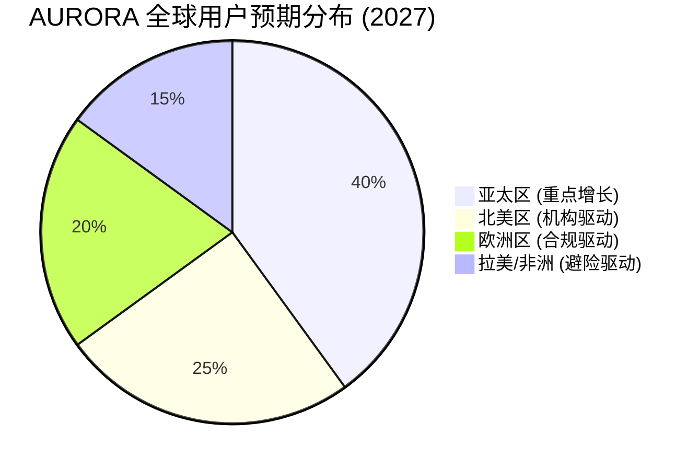

# 第十二章：区域化战略：全球化视野下的本地化社区增长

#### 12.1 极光大使计划 (Aurora Ambassadors)：全球价值传递者
AURORA 的全球扩张依赖于高度本地化的社区驱动。我们在全球四大核心语区招募 **1000 名极光大使**，构建一个去中心化的宣发矩阵。

*   **职责范围**：
    *   **本地化叙事**：将白皮书及技术文档翻译为母语，并根据当地文化习惯进行品牌叙事。
    *   **线下工作坊 (Aurora Meetups)**：在核心城市举办“Web4 与 AI 金融”专题沙龙，降低普通用户的进入门槛。
    *   **节点运营支持**：协助当地的节点运营商完成硬件部署与网络优化。
*   **激励机制**：
    *   大使将获得专属的“大使算力加成”。其推荐的用户每贡献一次黑洞销毁，大使均可获得 0.5% 的 USDT 额外分红。
    *   拥有参与“极光闭门会议”与核心团队直接对话的权利。

#### 12.2 区域化合规底池与 RWA 适配
由于各国法律对 RWA 资产的定义不同，AURORA 采取“因地制宜”的策略：
*   **亚太区 (Asia-Pacific)**：侧重于高流动性的稳定币套利与代币化大宗商品（如 Pax Gold）接入。
*   **欧美区 (EMEA & North America)**：侧重于代币化美债 (Ondis) 与合规的房地产信托资产。
*   **拉美与非洲区 (Emerging Markets)**：针对高通胀环境下对“强通缩资产”的刚需，重点推广 AURORA 的黑洞价值重构逻辑，作为当地法币的对冲工具。

#### 12.3 社区自治分支 (Sub-DAOs)：区域化治理
当某一区域的活跃节点超过 100 个时，系统支持成立 **区域 Sub-DAO**：
*   **本地金库**：Sub-DAO 拥有一定比例的区域交易税费支配权，用于本地社区的建设与市场活动。
*   **特色提案**：Sub-DAO 可以发起针对本区域的特色激励提案（如：举办本地开发者黑客松）。
*   **文化定制**：支持在 Aurora Assistant 中集成当地语言的多模态交互界面。

#### 12.4 全球流动性走廊 (Global Liquidity Corridor)
AURORA 旨在构建一个无国界的金融网络。
*   **跨链调度**：通过 AI 引擎的跨链调度，即便用户身处金融基础设施落后的地区，也能通过一部手机、一个 Aurora OS 助手，享受到全球最顶级的量化收益成果。
*   **支付集成**：未来计划与当地的加密借记卡供应商合作，实现算力产出（USDT）的实时线下消费。

**区域增长矩阵预测 (2027)：**

#### 12.5 极光学院 (Aurora Academy)
为了提升社区的整体金融素养，我们设立了极光学院：
*   **课程体系**：涵盖 AI 量化基础、区块链安全、Web4 哲学等课程。
*   **结业奖励**：完成课程并通过考核的用户将获得“知识算力勋章”，永久提升 0.1% 的分红权重。
