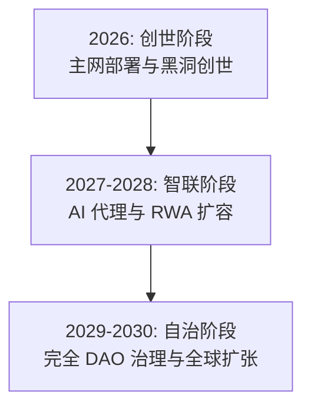

# 第十三章：五年战略路线图：极光三部曲 (2026-2030)

AURORA 的发展不仅是技术的迭代，更是全球财富共识的迁移过程。我们将其划分为三个核心阶段。

**战略规划时间轴：**

#### 13.1 阶段一：极光初现 (2026) —— 建立信任底座

> **核心目标**：完成主网部署，建立全球首批 500 个物理节点，实现 AURORA 代币的初步通缩。

*   **2026 Q1：创世大爆炸**
    *   AURORA 主网合约正式部署，开启黑洞创世竞赛。
    *   发布 AuraPredict 1.0 Beta，支持主流资产（BTC/ETH）的波动率预测。
*   **2026 Q2：节点矩阵构建**
    *   全球 500 个创世节点完成多签初始化与硬件部署。
    *   启动“极光大使”全球招募计划。
*   **2026 Q3：AI 策略实战化**
    *   Aura-Executor 自动化执行模块上线，开启首笔财库回购销毁。
    *   集成首批代币化美债 (RWA) 收益底座。
*   **2026 Q4：通缩里程碑**
    *   总供应量预计通缩至 75,000,000 枚。
    *   发布《AURORA 年度安全与精算透明度报告》。

#### 13.2 阶段二：智联万物 (2027-2028) —— 普惠金融扩张

> **核心目标**：推出移动端 OS，实现 RWA 规模化管理，代币完成 90% 通缩目标。

*   **2027 Q2：极光 OS 移动化**
    *   **Aurora OS 移动端**（Android/iOS）正式发布，集成 AI 语音交易助手。
    *   推出“算力跟单”功能，实现小白用户一键同步专家节点策略。
*   **2027 Q4：RWA 规模化**
    *   RWA 算力底池规模目标突破 100 亿 USDT，涵盖房产、国债及大宗商品。
    *   与全球主流合规预言机完成深度协议集成。
*   **2028 Q3：通缩临界点**
    *   代币完成 90% 通缩（剩余 10,000,000 枚），**正式开启二级市场双向交易**。
    *   AuraPredict v2.5 版本上线，支持多模态社交情绪分析。

#### 13.3 阶段三：星火永续 (2029-2030) —— 全球金融操作系统

> **核心目标**：实现完全去中心化自治，AURORA 成为全球智能数字黄金标准。
*   **2029：API 驱动的生态爆炸**
    *   AURORA API 成为全球 Web4 金融应用的标准预测接口，数千个 DApp 在极光网络上运行。
    *   实现完全的去中心化存储与算力调度，无单点故障风险。
*   **2030：主权自治与权限销毁**
    *   实现完全的“自治运行”，所有核心开发权限通过多签彻底销毁。
    *   AURORA 成为全球范围内抗通胀、高收益的“智能数字黄金”，系统进入万年永续模式。

#### 13.4 长期愿景：跨星际金融共识
在 2030 年之后，AURORA 实验室的目标是探索基于量子计算的 AI 预测模型，并致力于将这种智能金融共识扩展到更广阔的数字化生存空间，实现人类文明财富的永续增值。
