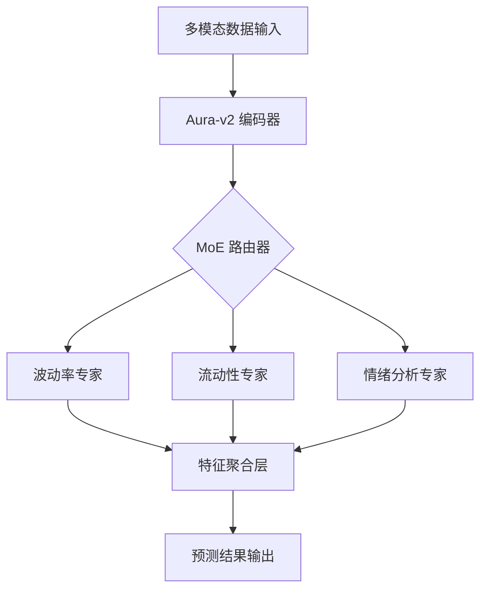

# 第四章 (上)：AuraPredict AI 模型与架构

#### 4.1 Aura-Transformer-v2：超大规模时序预测模型
AuraPredict 的核心是基于 Transformer 架构深度优化的 **Aura-v2 神经网络**。不同于处理文本的 GPT 模型，Aura-v2 专为非平稳、高噪声的加密金融数据量身定制。

**核心技术特性：**
*   **因果注意力机制 (Causal Multi-Head Attention)**：
    $$ \text{Attention}(Q, K, V) = \text{softmax}\left(\frac{QK^T + M}{\sqrt{d_k}}\right)V $$
    通过引入掩码矩阵 $M$，确保预测 $t+1$ 时刻时，模型严格无法接触 $t+1$ 之后的数据，彻底杜绝了数据泄露。
*   **多尺度时间分片 (Temporal Chunking)**：
    模型同时在 1min、15min、1h、1d 四个尺度上并行卷积。捕捉瞬时的“插针”行情（秒级）与宏观的周期趋势（月级）。
*   **稀疏专家架构 (MoE - Mixture of Experts)**：
    集成 128 个专业子网络（Experts），包括：
    *   **波动率预测专家 (Volatility Expert)**：分析资产价格的标准差演变。
    *   **巨鲸建仓识别专家 (Whale Detector)**：识别 0.1% 核心钱包的异常资金流。
    *   **RWA 溢价精算专家 (RWA Actuary)**：计算实物资产与链上映射资产的利差。
    路由网络根据输入信号自动激活最相关的专家，在维持 100B 参数量的同时，单次推理延迟低于 50ms。

#### 4.2 联邦学习 (Federated Learning) 与分布式训练
为了防止 AI 模型的中心化垄断，AURORA 采用了分布式联邦学习框架：
1.  **本地模型更新**：全球 500 个创世节点利用本地收集的市场数据训练微缩模型。
2.  **梯度聚合**：仅将模型权重（而非原始数据）提交至主网进行安全聚合。
3.  **防止投毒攻击**：采用 **中位数聚合 (Median Aggregation)** 算法，即使 30% 的节点提交恶意数据，整体预测精度依然保持稳定。

**技术架构全景图：**

