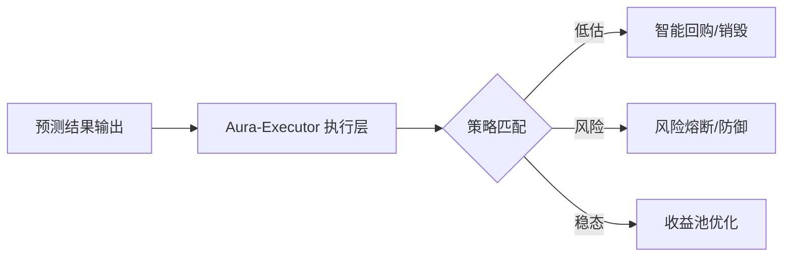

# 第四章 (下)：多模态感知与自动化执行

#### 4.3 多模态数据感知矩阵 (Data Sensor Matrix)
为了实现“预见未来”，AI 需要全方位的感官系统：

1.  **链上微观物理层 (Micro-On-chain Layer)**：
    *   实时解析全链 2,000,000+ 核心地址的 UTXO 与余额变动。
    *   **流动性深度分析**：实时计算 DEX 中各底池的滑点与攻击风险系数。
2.  **社交心理情绪层 (Psychological Sentiment Layer)**：
    *   利用深度 NLP 模型实时抓取 Twitter、Discord、Telegram 的 100W+ 日均评论。
    *   **情绪极化分析**：量化市场的恐惧与贪婪指数，识别“情绪拐点”。
3.  **宏观全球金融层 (Macro-Global Layer)**：
    *   接入美联储 (Fed) 隔夜利率、CPI、非农等宏观数据。
    *   **RWA 锚定监控**：监控黄金、国债等底层实物资产的链上估值异动。

#### 4.4 自动化执行：Aura-Executor 与风险熔断
预测只是起点，执行才是价值。**Aura-Executor** 是协议的“执剑人”。

*   **智能回购 (AI-Buyback)**：
    当 AI 预测到价格处于严重低估区间且未来 48 小时上涨概率 > 85% 时，Executor 自动调用财库资金执行阶梯式回购并销毁。
*   **风险熔断机制 (Circuit Breaker)**：
    一旦识别到类似“Luna 式崩盘”或“FTX 式挤兑”的非线性异常模式，系统在毫秒级内自动提升底池分红准备金，并向节点发布紧急避险信号。

#### 4.5 AuraPredict 与传统量化模型 (PanAgora) 的维度对比
AuraPredict 继承并超越了 PanAgora 的“上下文阿尔法建模”：
*   **动态因子演化**：传统量化使用固定因子，AuraPredict 因子随 AI 学习每秒都在进化。
*   **算力平权**：通过分布式算力节点，将原本专属于机构的预测能力下沉给每一位普通持币者。

**执行流转逻辑图：**

