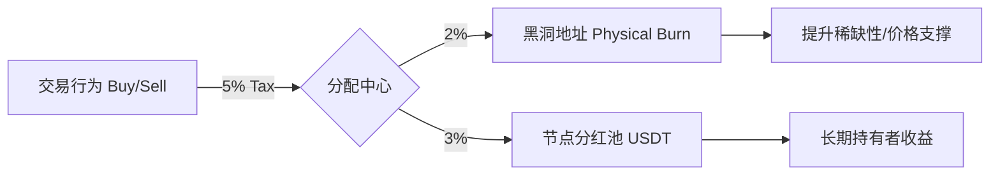

# 第五章 (上)：强通缩货币模型与税费体系

AURORA 代币（符号：AURORA）是 Web4 生态的血液，其设计核心在于**“极度稀缺”**、**“强通缩”**与**“博弈均衡”**。我们彻底抛弃了传统 DeFi 的高排放（Emission）模型，转而追求一种类似于“物理黑洞”的负增长逻辑。

#### 5.1 供应量函数与负指数通缩模型
不同于传统代币的通胀逻辑，AURORA 的供应量遵循负指数衰减规律。

**供应量演化公式：**
$$ S(t) = S_{initial} \cdot e^{-\lambda t} $$
其中，衰减系数 $\lambda$ 是交易活跃度 ($V$)、黑洞转换率 ($\alpha$) 与 AI 调节因子 ($\gamma$) 的动态函数：
$$ \lambda = k_1 \cdot V_{volume} + k_2 \cdot \alpha_{blackhole} + k_3 \cdot \gamma_{AI} $$

**供应量分配全景图：**
*   **初始发行总量**：100,000,000 AURORA
*   **终极流通目标**：10,000,000 AURORA (通缩 90%)
*   **0 私募、0 预留、0 团队份额**：100% 市场公开流动性产生，确保了生态的绝对公平。这种“纯净发射”（Fair Launch）模式杜绝了机构砸盘的风险。

#### 5.2 交易税费博弈模型：3% 与 2% 的纳什均衡
AURORA 设定了买卖各 5% 的交易税费，这不仅是协议收入，更是维持生态博弈平衡的重力场。

**税费流向图：**

1.  **物理销毁池 (2%)**：每笔交易的 2% 直接被打入黑洞地址。这部分代币在数学上永久消失，直接减少总分母，提升单币价值。
2.  **节点分红池 (3%)**：以 USDT 形式发放给全球节点。这确保了持币者的收益是“法币本位”的真金白银，而非更多贬值的代币。
