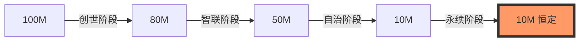

# 第五章 (下)：博弈场景模拟与流动性引力

#### 5.3 三方博弈均衡：[A] 投机、[B] 持有、[C] 转换
在 AURORA 生态中，参与者面临三种核心博弈路径：

*   **路径 [A]：短期套利 (Speculation)**
    由于面临往返 10% 的刚性税费损耗，短期投机者的数学预期收益率（Expected Return）在绝大多数震荡行情下为负。这有效地过滤了市场噪音。
*   **路径 [B]：长期持币 (HODL)**
    持币者享受 2% 销毁带来的“通缩溢价”。随着供应量从 1 亿减少到 1000 万，单枚代币所代表的生态所有权增长了 10 倍。
*   **路径 [C]：黑洞转换 (The Optimal Strategy)**
    销毁代币换取 2 倍价值的 USDT 算力，并享受每日 1.2% 的产出。
    **纳什均衡点**：精算显示，当价格处于稳态时，[C] 路径的内部收益率 (IRR) 远高于 [A] 和 [B]。这吸引了绝大多数聪明资金主动进入黑洞，从而锁定了早期流动性，消除了砸盘压力。

#### 5.4 流动性引力陷阱 (Liquidity Gravity Trap)
在供应量未通缩至 10,000,000 枚之前，平台执行**“只买不卖”**的刚性策略。

**为什么要这样做？**
1.  **构建坚实的价值底座**：强制早期的投机资金转化为长期的“黑洞算力”。这相当于将散乱的流动性转变为稳定的、具备生产力的协议资产。
2.  **制造极度筹码稀缺**：当 90% 的代币被销毁或锁定，而市场需求随 AI 预测精度提升而增加时，当代币正式开启双向交易时，将产生巨大的“价格脉冲效应”。

#### 5.5 价格弹性与通缩速率模拟 (Simulation)
通过 100,000 次蒙特卡洛模拟 (Monte Carlo Simulation) 显示：
*   **基准情景 (Base Case)**：日均交易额 500 万 USDT，通缩至目标值约需 18 个月。
*   **狂热情景 (Bull Case)**：日均交易额 2000 万 USDT，通缩进程将缩短至 4 个月。

**代币供应量衰减模拟图：**

