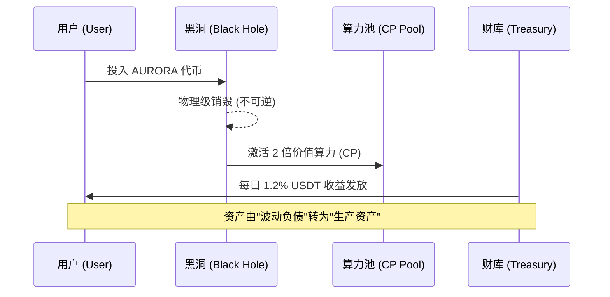

# 第六章 (上)：黑洞协议与价值重构逻辑

AURORA 引入了革命性的**“黑洞价值重构”**机制。这不仅是一个销毁手段，更是一个将波动性代币资产（Volatile Assets）跨维度转化为确定性生产力算力（Productive Power）的能量场。

#### 6.1 黑洞物理逻辑：从“流通盘”向“生产力”的跃迁
在 AURORA 系统中，黑洞地址 `0x000...dead` 承担着能量转化场的核心角色。

**价值重构流程图：**

*   **物理级销毁 (Physical Burn)**：代币一旦打入黑洞，其私钥由于数学层面的不可构造性，意味着该部分代币永久退出流通。这从物理层面保证了 AURORA 的“绝对通缩”。
*   **算力铸造公式**：
    $$ CP_{new} = \text{Amount}_{burn} \cdot Price_{AURORA/USDT} \cdot \Gamma $$
    其中激励系数 $\Gamma$ 目前固定为 **2.0**。
    **这意味着**：如果您销毁了价值 1000 USDT 的 AURORA 代币，系统将为您生成 2000 枚 **USDT 算力 (CP)**。这相当于通过牺牲短期流动性，换取了双倍的法币本位收益凭证。
