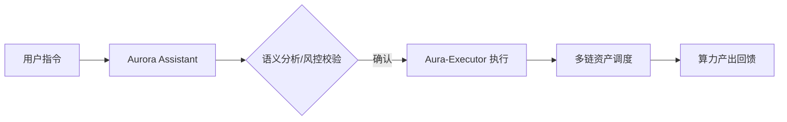

# 第七章：用户体验：AI 代理助手与极光操作系统 (Aurora OS)

#### 7.1 重新定义人机交互：极光助手 (Aurora Assistant)
在 Web4 时代，用户不应被淹没在复杂的 K 线图和技术指标中。AURORA 推出了 **极光助手**，这是一个具备自然语言处理能力的 AI 代理。

*   **语义识别交易 (Natural Language Trading)**：
    用户无需学习复杂的智能合约交互，只需输入自然语言指令。
    *   *示例*：“帮我配置 1000 USDT 到高收益算力池，并在 AURORA 价格下跌 10% 时自动补仓。”
    *   *逻辑*：助手通过后台的 Intent-Centric 引擎，自动完成买入、黑洞转换、质押及限价单设置。
*   **个性化风险画像 (AI Risk Profiling)**：
    助手通过分析用户的链上历史行为，利用 Aura-LLM 建立动态风险模型。
    *   对于保守型用户：优先配置 RWA 稳定收益底座。
    *   对于激进型用户：优先分配 AI 套利高波动溢价。
*   **全天候决策支持 (Decision Support)**：
    当 AI 引擎预测到市场波动超过预设阈值（如识别到潜在的闪崩风险）时，助手会通过 Telegram/Discord 的加密通道向用户发送决策建议，并提供一键执行的按钮。

#### 7.2 极光操作系统 (Aurora OS) 核心组件
Aurora OS 并非传统的底层内核，而是一个高度集成的智能金融 UI 框架，旨在抹平 Web2 与 Web3 的鸿沟：

1.  **收益仪表盘 (Yield Dashboard)**：
    采用多维可视化技术，实时展示“算力健康度”、“黑洞通缩贡献”及“节点全球分布图”。用户可以直观地看到自己的资产是如何通过黑洞转换并在全球节点中流转的。
2.  **策略画布 (Strategy Canvas)**：
    允许高级用户通过简单的模块拖拽（Drag-and-Drop），定制属于自己的 AI 交易逻辑。例如：“如果 $AURORA 通缩率 > 5\%$ 且 $BTC$ 波动率 < 2%，则自动执行复投。”
3.  **隐私保险箱 (Privacy Vault)**：
    利用零知识证明（ZKP）和同态加密技术，确保用户的个人身份、资产规模与交易偏好在享受 AI 预测服务时完全保密。即使是 AURORA 节点也无法获取用户的完整隐私数据。

#### 7.3 跨链无缝体验 (Chain-Agnostic Experience)
AURORA 不受限于单一区块链。通过集成的跨链流动性协议，用户可以在以太坊、Solana、Base 或 AURORA 原生链上无缝管理其算力资产。

**用户交互流转图：**

#### 7.4 社会化交互与算力分享 (SocialFi Integration)
*   **算力跟单**：普通用户可以一键订阅创世节点的 AI 策略，并将部分收益作为服务费分润给节点。
*   **社区激励**：在 Aurora OS 内部，活跃的治理参与者和高质量策略贡献者将获得额外的“活性系数”奖励，直接提升其算力产出效率。
