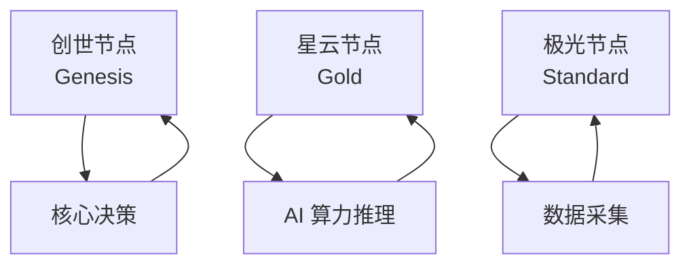
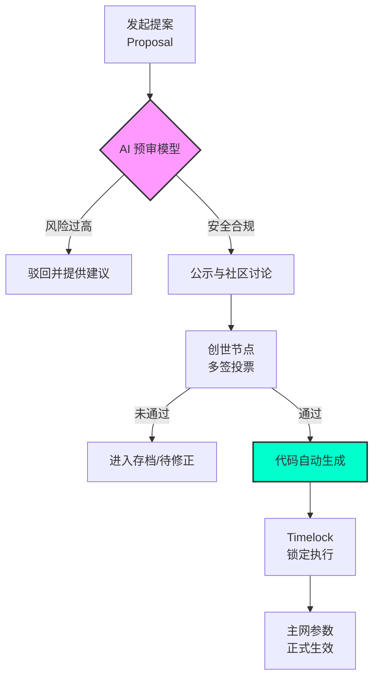

# 第八章：全球节点矩阵：分布式治理与贡献度模型

#### 8.1 节点的层级与职责：三维生产力矩阵
AURORA 节点是生态的脊梁，不仅负责维护网络共识，更承担着分布式 AI 推理与数据采集的重任。节点分为三个层级，每级都有其独特的生产任务与收益权重：

**节点矩阵架构：**

1.  **极光节点 (Standard)**：
    *   **职责**：负责基础市场数据的实时采集、社交媒体情绪抓取（NLP 前置处理）以及本地化社区宣发。
    *   **门槛**：持有 10,000 AURORA 或等值算力，并保持节点软件 7x24 小时在线。
    *   **收益**：享受 3% 税费分红池的基础权重。
2.  **星云节点 (Gold)**：
    *   **职责**：负责分布式 AI 推理的局部计算、跨链流动性监控以及 TEE 安全环境下的敏感数据处理。
    *   **门槛**：持有 50,000 AURORA，并配备符合规格的高性能计算硬件（建议 GPU 显存 > 12GB）。
    *   **收益**：分红权重提升 50%，并拥有 AI 高级分析功能（Alpha-Signal）的优先使用权。
3.  **创世节点 (Genesis)**：
    *   **数量**：全球限量 500 个，旨在建立一个高韧性的全球治理网络。
    *   **职责**：负责协议关键参数（如 $\Gamma$ 系数、税费比例）的投票确认、重大安全事项的多签管理以及 RWA 资产接入的最终审核。
    *   **门槛**：需通过 DAO 委员会的综合评估（持币量、社区影响力、技术贡献），并质押 200,000 AURORA。
    *   **收益**：享受 3 倍分红权重及生态孵化项目的早期空投。

#### 8.2 贡献度模型 (Reputation Score) 与动态分红
治理权不应仅仅与持币量挂钩。我们引入了 **Reputation Score (贡献分)**，它是决定节点最终收益的乘数：
*   **销毁贡献 ($R_b$)**：向黑洞贡献的代币数量越多，分越高。
*   **稳定性贡献 ($R_s$)**：节点在线率、响应速度及推理准确率。
*   **治理贡献 ($R_g$)**：参与 DAO 提案投票、提交代码补丁或撰写深度研报。
$$ \text{Total Score} = w_1 R_b + w_2 R_s + w_3 R_g $$

#### 8.3 DAO 治理提案流程：从意图到自动执行

AURORA 引入了 **“意图驱动 (Intent-driven)”** 的治理流程，确保每一项技术迭代或参数调整都经过 AI 的严苛压力测试与社区的民主表决。

#### 8.4 罚没机制 (Slashing Mechanism)
为防止节点作恶或长期静默，系统设有自动罚没逻辑：
*   **轻微违规**：节点断线超过 24 小时，扣除当日收益并降低 1% 贡献分。
*   **严重违规**：尝试提交伪造的 AI 预测数据或恶意串通攻击网络。
    *   *后果*：质押的 AURORA 代币将被 100% 没入黑洞地址，永久取消节点资格。

#### 8.5 极光宪法 (The Aurora Constitution)
所有的生态参与者均受“极光宪法”约束，这是一套硬编码在智能合约中的行为准则：
1.  **算法中立性**：AI 预测结果必须基于真实数学模型，任何个人或组织不得人为干预预测逻辑。
2.  **利益一致性**：核心团队（开发者）的利益与总供应量的通缩速度严格绑定。
3.  **无许可进入**：只要满足技术与经济门槛，任何人均可自由加入或退出节点矩阵，实现真正的去中心化。

#### 8.6 硬件规范与部署建议
为了支撑 AuraPredict 的高并发推理，星云级及以上节点建议采用以下配置：
*   **CPU**：16 核以上（如 AMD EPYC 或 Intel Xeon）
*   **RAM**：128GB DDR5
*   **GPU**：NVIDIA RTX 4090 或 A100 (支持算力加速)
*   **带宽**：1Gbps 独享对称光纤
*   **系统**：Aurora-OS (基于 Linux 深度定制)
