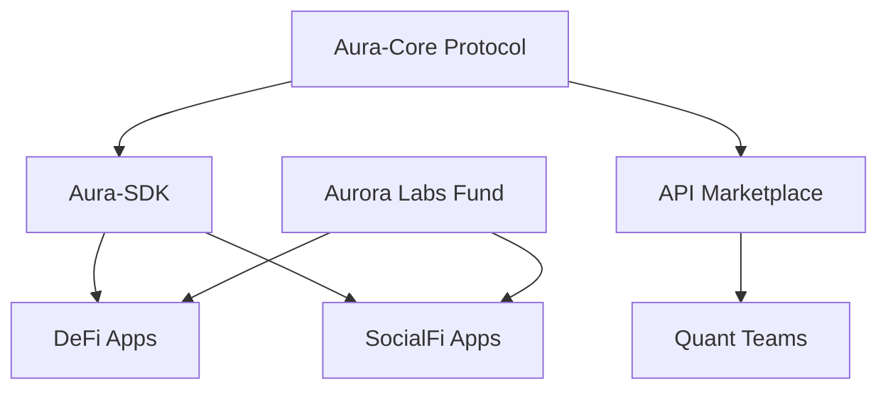

# 第九章：开发者生态：Aura-SDK、API 与极光实验室

#### 9.1 Aura-SDK：赋能第三方应用
AURORA 的愿景是成为 Web4 金融的基础设施。我们为全球开发者提供 **Aura-SDK**，支持 JavaScript, Python, Go, Rust 等多种主流编程语言。

**SDK 核心功能模块：**
*   **预测数据流 (Aura-Oracle Stream)**：允许第三方 DApp 实时调用 AuraPredict 的高精度金融预测结果，用于构建自动化清算、动态保证金等高级金融功能。
*   **算力资产集成 (CP Asset Integration)**：开发者可以在自己的应用（如 GameFi 或 SocialFi）中集成 AURORA 算力，作为底层的抵押物或收益增强插件。
*   **隐私计算模块 (ZKP Toolkit)**：内置零知识证明工具包，支持开发者在不接触用户私钥的情况下完成复杂的策略授权。

#### 9.2 极光 API 市场 (Aurora API Marketplace)
这是一个去中心化的数据与算法交易平台，旨在打破“数据孤岛”。

1.  **数据供应方**：节点或专业数据公司可以将其采集的深度链上/链下原始数据，通过 API 形式挂牌出售。
2.  **算法供应方**：量化团队可以将其开发的专业 MoE 专家子网络上传至市场，供其他用户订阅。
3.  **清算机制**：所有的 API 调用均通过 AURORA 代币进行实时微支付（Micropayments），收益 100% 归供应方所有，协议不抽取任何佣金。

#### 9.3 极光实验室 (Aurora Labs) 孵化计划
我们将拨出总产出的 1% 作为“极光实验室基金”，用于孵化和资助基于 Web4 理念的初创项目。

**重点孵化方向：**
*   **AI 算法稳定币**：基于 AuraPredict 预测结果自动调节供应量的下一代稳定币。
*   **去中心化保险协议**：利用 AI 评估风险概率，实现毫秒级的自动赔付逻辑。
*   **RWA 资产代币化平台**：将物理世界的资产更高效地接入 AURORA 算力底座。

#### 9.4 开发者贡献度与治理 (Developer Governance)
在 AURORA DAO 中，代码贡献（Proof of Code）被视为与持币同等重要的价值产出。
*   **代码审计奖励**：发现并修复核心协议漏洞的开发者将获得巨额 AURORA 代币奖励。
*   **EIP (Aurora Improvement Proposals)**：任何开发者均可提交协议升级建议，经社区投票通过后由创世节点多签执行。

**开发者生态架构：**

